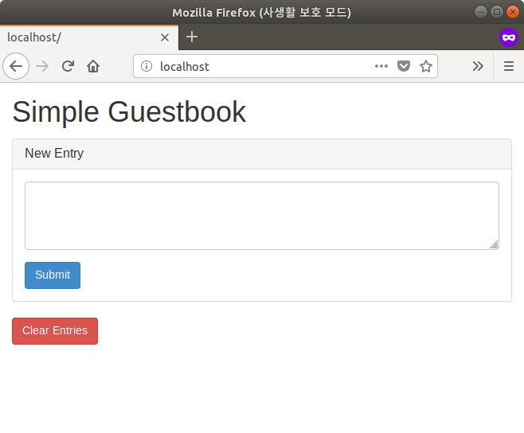
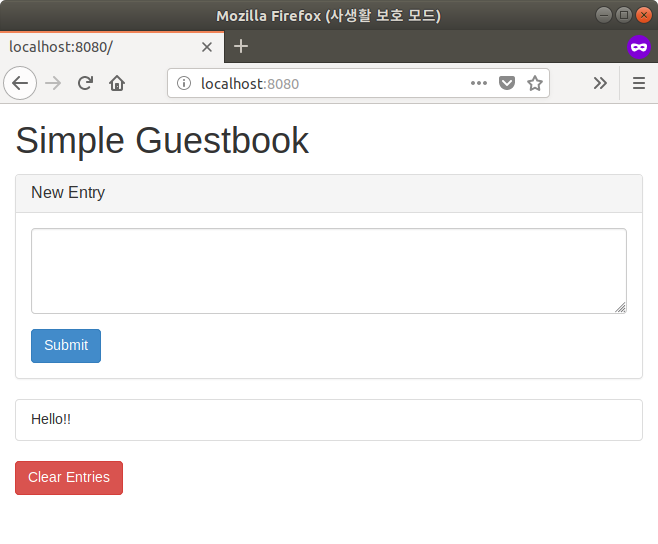

# [실습1] 도커 컨테이너 장단점 체험

[TOC]

## LAB

### Docker Hub

Docker Hub 에서 CentOS 이미지를 가져와 , 컨테이너 실행 후 Shell 에 접근하여 둘러보기

```shell
# lab001 디렉토리로 이동
$ cd ~/labhome/lab001

# 현재 접근 중인 호스트 OS 버전 확인 => Ubuntu 18.04 사용 중
$ lsb_release -a
No LSB modules are available.
Distributor ID:	Ubuntu
Description:	Ubuntu 18.04.1 LTS
Release:	18.04
Codename:	bionic


# docker search 명령어를 이용해 Docker Hub 에서 CentOS 이미지 검색하기
$ docker search centos | head -n 5
NAME                               DESCRIPTION                                     STARS               OFFICIAL            AUTOMATED
centos                             The official build of CentOS.                   4585                [OK]                
ansible/centos7-ansible            Ansible on Centos7                              115                                     [OK]
jdeathe/centos-ssh                 CentOS-6 6.10 x86_64 / CentOS-7 7.5.1804 x86…   99                                      [OK]
consol/centos-xfce-vnc             Centos container with "headless" VNC session…   61                                      [OK]


# docker run 명령으로 CentOS 컨테이너 구동 둘러보기
$ docker run -it centos
[root@b01c50f2de32 /]# cat /etc/redhat-release 
CentOS Linux release 7.5.1804 (Core) 


[root@b01c50f2de32 /]# ps -ef 
UID        PID  PPID  C STIME TTY          TIME CMD
root         1     0  0 11:40 pts/0    00:00:00 /bin/bash
root        17     1  0 11:40 pts/0    00:00:00 ps -ef


[root@b01c50f2de32 /]# df -hT
Filesystem     Type     Size  Used Avail Use% Mounted on
overlay        overlay  234G  9.4G  212G   5% /
tmpfs          tmpfs     64M     0   64M   0% /dev
tmpfs          tmpfs    7.8G     0  7.8G   0% /sys/fs/cgroup
/dev/sda2      ext4     234G  9.4G  212G   5% /etc/hosts
shm            tmpfs     64M     0   64M   0% /dev/shm
tmpfs          tmpfs    7.8G     0  7.8G   0% /proc/scsi
tmpfs          tmpfs    7.8G     0  7.8G   0% /sys/firmware


[root@b01c50f2de32 /]# yum -y -q update 2>&1
[root@b01c50f2de32 /]# yum -y -q install iproute 2>&1 
[root@b01c50f2de32 /]# ip a
1: lo: <LOOPBACK,UP,LOWER_UP> mtu 65536 qdisc noqueue state UNKNOWN group default qlen 1000
    link/loopback 00:00:00:00:00:00 brd 00:00:00:00:00:00
    inet 127.0.0.1/8 scope host lo
       valid_lft forever preferred_lft forever
5: eth0@if6: <BROADCAST,MULTICAST,UP,LOWER_UP> mtu 1500 qdisc noqueue state UP group default 
    link/ether 02:42:ac:11:00:02 brd ff:ff:ff:ff:ff:ff link-netnsid 0
    inet 172.17.0.2/16 brd 172.17.255.255 scope global eth0
       valid_lft forever preferred_lft forever


[root@b01c50f2de32 /]# yum -y -q install dstat
[root@b01c50f2de32 /]# dstat
You did not select any stats, using -cdngy by default.
----total-cpu-usage---- -dsk/total- -net/total- ---paging-- ---system--
usr sys idl wai hiq siq| read  writ| recv  send|  in   out | int   csw 
  4   1  95   0   0   0|1786k  505k|   0     0 |   0     0 |1039  3750 
  1   0  99   0   0   0|   0     0 |   0     0 |   0     0 | 200   658 
  2   0  98   0   0   0|   0    52k|  42B   42B|   0     0 | 266   902 


# exit 명령으로 컨테이너 종료 후 호스트 쉘로 복귀
[root@b01c50f2de32 /]# exit
exit


$ lsb_release -a
No LSB modules are available.
Distributor ID:	Ubuntu
Description:	Ubuntu 18.04.1 LTS
Release:	18.04
Codename:	bionic


$ docker ps
CONTAINER ID        IMAGE               COMMAND             CREATED             STATUS              PORTS               NAMES


$ docker ps --all
CONTAINER ID        IMAGE               COMMAND             CREATED             STATUS                            PORTS               NAMES
b01c50f2de32        centos              "/bin/bash"         10 minutes ago      Exited (127) About a minute ago                       peaceful_darwin


$ docker rm b01c50f2de32
b01c50f2de32


$ docker ps --all
CONTAINER ID        IMAGE               COMMAND             CREATED             STATUS              PORTS               NAMES


$ docker images
REPOSITORY          TAG                 IMAGE ID            CREATED             SIZE
centos              latest              5182e96772bf        12 days ago         200MB


$ docker rmi 5182e96772bf
Untagged: centos:latest
Untagged: centos@sha256:6f6d986d425aeabdc3a02cb61c02abb2e78e57357e92417d6d58332856024faf
Deleted: sha256:5182e96772bf11f4b912658e265dfe0db8bd314475443b6434ea708784192892
Deleted: sha256:1d31b5806ba40b5f67bde96f18a181668348934a44c9253b420d5f04cfb4e37a


$ docker images
REPOSITORY          TAG                 IMAGE ID            CREATED             SIZE

```

### File Persistence

실행된 컨테이너에 임시 파일 생성 후 다시 구동하여 생성한 파일 확인 

```shell
$ docker run --name web -d nginx:alpine
adb10e91436daed429512b7d8c9a81baf68ad3b0c59b02824b9241070bd3f911

$ docker ps
CONTAINER ID        IMAGE               COMMAND                  CREATED             STATUS              PORTS               NAMES
adb10e91436d        nginx:alpine        "nginx -g 'daemon of…"   36 seconds ago      Up 35 seconds       80/tcp              web

$ docker inspect web | head -n 10
[
    {
        "Id": "adb10e91436daed429512b7d8c9a81baf68ad3b0c59b02824b9241070bd3f911",
        "Created": "2018-08-19T12:00:10.546054364Z",
        "Path": "nginx",
        "Args": [
            "-g",
            "daemon off;"
        ],
        "State": {

# 나머지 출력 부분 생략 #


$ docker inspect web | grep IPAddress
            "SecondaryIPAddresses": null,
            "IPAddress": "172.17.0.2",
                    "IPAddress": "172.17.0.2",
                    
$ docker inspect web --format "{{.NetworkSettings.IPAddress}}"
172.17.0.2

$ curl 172.17.0.2
<!DOCTYPE html>
<html>
<head>
<title>Welcome to nginx!</title>
<style>
    body {
        width: 35em;
        margin: 0 auto;
        font-family: Tahoma, Verdana, Arial, sans-serif;
    }
</style>
</head>
<body>
<h1>Welcome to nginx!</h1>
<p>If you see this page, the nginx web server is successfully installed and
working. Further configuration is required.</p>

<p>For online documentation and support please refer to
<a href="http://nginx.org/">nginx.org</a>.<br/>
Commercial support is available at
<a href="http://nginx.com/">nginx.com</a>.</p>

<p><em>Thank you for using nginx.</em></p>
</body>
</html>

$ docker exec -i -t web /bin/ash
/ # ls /usr/share/nginx/html/
50x.html    index.html
/ # echo "Hello! I was here!!" > /usr/share/nginx/html/index.html 
/ # cat /usr/share/nginx/html/index.html
Hello! I was here!!
/ # exit

$ curl 172.17.0.2
Hello! I was here!!


$ docker stop web
web

$ docker rm web
web

$ docker run --name web -d nginx:alpine
ec4e99e7a0188867ebdd0efefb67b6216612a179c24f7b8434e2f7ac4f1657d9

$ docker inspect web --format "{{.NetworkSettings.IPAddress}}"
172.17.0.2

$ curl 172.17.0.2
<!DOCTYPE html>
<html>
<head>
<title>Welcome to nginx!</title>
<style>
    body {
        width: 35em;
        margin: 0 auto;
        font-family: Tahoma, Verdana, Arial, sans-serif;
    }
</style>
</head>
<body>
<h1>Welcome to nginx!</h1>
<p>If you see this page, the nginx web server is successfully installed and
working. Further configuration is required.</p>

<p>For online documentation and support please refer to
<a href="http://nginx.org/">nginx.org</a>.<br/>
Commercial support is available at
<a href="http://nginx.com/">nginx.com</a>.</p>

<p><em>Thank you for using nginx.</em></p>
</body>
</html>

$ docker stop web
web

$ docker rm web
web
```

### Build Docker Image

Dockerfile 내용 리뷰 후 직접 Docker Image 빌드 및 구동 확인 

```shell
# lab001 빌드 예제 디렉토리로 이동
$ cd ~/labhome/lab001/build-example

$ ls
Dockerfile  main.go

$ cat Dockerfile 
FROM golang:1.8-alpine
ADD . /go/src/hello-app
RUN go install hello-app

FROM alpine:latest
COPY --from=0 /go/bin/hello-app .
ENV PORT 8080
CMD ["./hello-app"]

$ docker build -t hello-app:v1 .
Sending build context to Docker daemon  4.096kB
Step 1/7 : FROM golang:1.8-alpine
1.8-alpine: Pulling from library/golang
550fe1bea624: Pull complete 
cbc8da23026a: Pull complete 
9b35aaa06d7a: Pull complete 
46ca6ce0ffd1: Pull complete 
7a270aebe80a: Pull complete 
8695117c367e: Pull complete 
Digest: sha256:693568f2ab0dae1e19f44b41628d2aea148fac65974cfd18f83cb9863ab1a177
Status: Downloaded newer image for golang:1.8-alpine
 ---> 4cb86d3661bf
Step 2/7 : ADD . /go/src/hello-app
 ---> 82446e981087
Step 3/7 : RUN go install hello-app
 ---> Running in 3581c7414c92
Removing intermediate container 3581c7414c92
 ---> 76dd3f5f8be6
Step 4/7 : FROM alpine:latest
latest: Pulling from library/alpine
8e3ba11ec2a2: Pull complete 
Digest: sha256:7043076348bf5040220df6ad703798fd8593a0918d06d3ce30c6c93be117e430
Status: Downloaded newer image for alpine:latest
 ---> 11cd0b38bc3c
Step 5/7 : COPY --from=0 /go/bin/hello-app .
 ---> a05b76904ecb
Step 6/7 : ENV PORT 8080
 ---> Running in 0e2bd43eb419
Removing intermediate container 0e2bd43eb419
 ---> e17618217313
Step 7/7 : CMD ["./hello-app"]
 ---> Running in c01293cfea37
Removing intermediate container c01293cfea37
 ---> 39d08a5c7d62
Successfully built 39d08a5c7d62
Successfully tagged hello-app:v1

$ docker images
REPOSITORY          TAG                 IMAGE ID            CREATED             SIZE
hello-app           v1                  39d08a5c7d62        13 seconds ago      10.3MB
<none>              <none>              76dd3f5f8be6        19 seconds ago      263MB
alpine              latest              11cd0b38bc3c        6 weeks ago         4.41MB
golang              1.8-alpine          4cb86d3661bf        6 months ago        257MB

$ docker run --name hello-app -d -p 8080:8080 hello-app:v1
dfd995649892dba5b59d4e1cb74f6c60b019f986e97d0ca67be2172ffa2f72dc

$ docker inspect hello-app --format "{{.NetworkSettings.Ports}}"
map[8080/tcp:[{0.0.0.0 8080}]]

$ curl localhost:8080
Hello, world!
Version: 1.0.0
Hostname: dfd995649892

$ docker stop $(docker ps -qa)
$ docker rm $(docker ps -qa)
$ docker ps -a
CONTAINER ID        IMAGE               COMMAND             CREATED             STATUS              PORTS               NAMES


$ sed -i 's/Hello\, world!/Hello\, docker!/' ./main.go
$ sed -i 's/Version: 1\.0\.0/Version: 2\.0\.0/' ./main.go
$ tail -n 10 main.go 

// hello responds to the request with a plain-text "Hello, world" message.
func hello(w http.ResponseWriter, r *http.Request) {
	log.Printf("Serving request: %s", r.URL.Path)
	host, _ := os.Hostname()
	fmt.Fprintf(w, "Hello, docker!\n")
	fmt.Fprintf(w, "Version: 2.0.0\n")
	fmt.Fprintf(w, "Hostname: %s\n", host)
}
// [END all]

$ docker build -t hello-app:v2 .
Sending build context to Docker daemon  4.096kB
Step 1/7 : FROM golang:1.8-alpine
 ---> 4cb86d3661bf
Step 2/7 : ADD . /go/src/hello-app
 ---> 4b67a84aa7c9
Step 3/7 : RUN go install hello-app
 ---> Running in abd92a01bcc6
Removing intermediate container abd92a01bcc6
 ---> be3028f6404c
Step 4/7 : FROM alpine:latest
 ---> 11cd0b38bc3c
Step 5/7 : COPY --from=0 /go/bin/hello-app .
 ---> 98796e6fa1fd
Step 6/7 : ENV PORT 8080
 ---> Running in 7eb08f8f9309
Removing intermediate container 7eb08f8f9309
 ---> a278600c0c06
Step 7/7 : CMD ["./hello-app"]
 ---> Running in 812abc4449a8
Removing intermediate container 812abc4449a8
 ---> 90efa4cb5d3a
Successfully built 90efa4cb5d3a
Successfully tagged hello-app:v2

$ docker images hello*
REPOSITORY          TAG                 IMAGE ID            CREATED             SIZE
hello-app           v2                  90efa4cb5d3a        31 seconds ago      10.3MB
hello-app           v1                  0eae26caad84        11 minutes ago      10.3MB

$ docker run --name hello-app -d -p 8080:8080 hello-app:v2
43ecc10e10c7629dabb8c1e2cc15856cdc5f8e43bac8fb156888c047054939b3

$ curl localhost:8080
Hello, docker!
Version: 2.0.0
Hostname: 43ecc10e10c7

$ docker stop $(docker ps -qa)
$ docker rm $(docker ps -qa)
$ docker ps -a
CONTAINER ID        IMAGE               COMMAND             CREATED             STATUS              PORTS               NAMES

```

### Run multi-contianer with Compose

Docker Compose 이용하여 다수의 컨테이너로 구성된 서비스 배포 후 접근 확인 

```shell
# lab001 compose-exmaple 디렉토리로 이동
$ cd ~/labhome/lab001/compose-example

$ docker run --name guestbook-redis -d -p 6379:6379 redis:alpine
Unable to find image 'redis:alpine' locally
alpine: Pulling from library/redis
8e3ba11ec2a2: Pull complete 
1f20bd2a5c23: Pull complete 
782ff7702b5c: Pull complete 
82d1d664c6a7: Pull complete 
69f8979cc310: Pull complete 
3ff30b3bc148: Pull complete 
Digest: sha256:43e4d14fcffa05a5967c353dd7061564f130d6021725dd219f0c6fcbcc6b5076
Status: Downloaded newer image for redis:alpine
25c34b9ad358728158102c6fda90908188cca55566083726e0ec2cb6ac2cebaa

$ redis-cli ping
PONG

$ cat Dockerfile 
FROM python:2-alpine
RUN pip install redis flask
ADD app /app
EXPOSE 80
CMD [ "python", "/app/app.py" ]

$ docker build -t guestbook-python:v1 .
Sending build context to Docker daemon  159.7kB
Step 1/5 : FROM python:2-alpine
2-alpine: Pulling from library/python
8e3ba11ec2a2: Pull complete 
ea489525e565: Pull complete 
888674c38387: Pull complete 
d38724cba2df: Pull complete 
Digest: sha256:aebe7b0616585705523c0683f0fca6108f80f1ae88178133fc7f294e3663af88
Status: Downloaded newer image for python:2-alpine
 ---> 7c306adf1b3d
Step 2/5 : RUN pip install redis flask
 ---> Running in 6c3319e8a8f9
Collecting redis
  Downloading https://files.pythonhosted.org/packages/3b/f6/7a76333cf0b9251ecf49efff635015171843d9b977e4ffcf59f9c4428052/redis-2.10.6-py2.py3-none-any.whl (64kB)
Collecting flask
  Downloading https://files.pythonhosted.org/packages/7f/e7/08578774ed4536d3242b14dacb4696386634607af824ea997202cd0edb4b/Flask-1.0.2-py2.py3-none-any.whl (91kB)
Collecting Werkzeug>=0.14 (from flask)
  Downloading https://files.pythonhosted.org/packages/20/c4/12e3e56473e52375aa29c4764e70d1b8f3efa6682bef8d0aae04fe335243/Werkzeug-0.14.1-py2.py3-none-any.whl (322kB)
Collecting click>=5.1 (from flask)
  Downloading https://files.pythonhosted.org/packages/34/c1/8806f99713ddb993c5366c362b2f908f18269f8d792aff1abfd700775a77/click-6.7-py2.py3-none-any.whl (71kB)
Collecting itsdangerous>=0.24 (from flask)
  Downloading https://files.pythonhosted.org/packages/dc/b4/a60bcdba945c00f6d608d8975131ab3f25b22f2bcfe1dab221165194b2d4/itsdangerous-0.24.tar.gz (46kB)
Collecting Jinja2>=2.10 (from flask)
  Downloading https://files.pythonhosted.org/packages/7f/ff/ae64bacdfc95f27a016a7bed8e8686763ba4d277a78ca76f32659220a731/Jinja2-2.10-py2.py3-none-any.whl (126kB)
Collecting MarkupSafe>=0.23 (from Jinja2>=2.10->flask)
  Downloading https://files.pythonhosted.org/packages/4d/de/32d741db316d8fdb7680822dd37001ef7a448255de9699ab4bfcbdf4172b/MarkupSafe-1.0.tar.gz
Building wheels for collected packages: itsdangerous, MarkupSafe
  Running setup.py bdist_wheel for itsdangerous: started
  Running setup.py bdist_wheel for itsdangerous: finished with status 'done'
  Stored in directory: /root/.cache/pip/wheels/2c/4a/61/5599631c1554768c6290b08c02c72d7317910374ca602ff1e5
  Running setup.py bdist_wheel for MarkupSafe: started
  Running setup.py bdist_wheel for MarkupSafe: finished with status 'done'
  Stored in directory: /root/.cache/pip/wheels/33/56/20/ebe49a5c612fffe1c5a632146b16596f9e64676768661e4e46
Successfully built itsdangerous MarkupSafe
Installing collected packages: redis, Werkzeug, click, itsdangerous, MarkupSafe, Jinja2, flask
Successfully installed Jinja2-2.10 MarkupSafe-1.0 Werkzeug-0.14.1 click-6.7 flask-1.0.2 itsdangerous-0.24 redis-2.10.6
Removing intermediate container 6c3319e8a8f9
 ---> a1c6646ece85
Step 3/5 : ADD app /app
 ---> 52f9a1feaf8a
Step 4/5 : EXPOSE 80
 ---> Running in e37b772084f4
Removing intermediate container e37b772084f4
 ---> 5928e6ac06fa
Step 5/5 : CMD [ "python", "/app/app.py" ]
 ---> Running in 69a3c8ad37e6
Removing intermediate container 69a3c8ad37e6
 ---> 685ec7bb78c8
Successfully built 685ec7bb78c8
Successfully tagged guestbook-python:v1

$ docker run --name guestbook-python -d --net=host guestbook-python:v1
f9f59be746ce77fbc6f958e17153a676b2c9c8386acd013a79db59e358c9349e

$ docker logs guestbook-python 
 * Serving Flask app "app" (lazy loading)
 * Environment: production
   WARNING: Do not use the development server in a production environment.
   Use a production WSGI server instead.
 * Debug mode: off
 * Running on http://0.0.0.0:80/ (Press CTRL+C to quit)
```


웹브라우저에서 http://localhost:80 접속하여, guestbook 이 정상적으로 구동되었는지 확인



```shell
# lab001 compose-exmaple 디렉토리로 이동
$ cd ~/labhome/lab001/compose-example

$ docker stop $(docker ps -qa)
$ docker rm $(docker ps -qa)

$ cat docker-compose.yml 
version: '3'
services:
  guestbook-python:
    # image: "guestbook-python:v1"
    build: .
    ports:
     - "8080:80"
  guestbook-redis:
    image: "redis:alpine"

$ cp app/app.py app/app.py.orig
$ sed -i 's/127\.0\.\0\.1/guestbook-redis/' ./app/app.py
$ grep guestbook-redis app/app.py
app.redis = redis.StrictRedis(host='guestbook-redis', port=6379, db=0)

$ docker-compose up
Creating network "composeexample_default" with the default driver
Building guestbook-python
Step 1/5 : FROM python:2-alpine
 ---> 7c306adf1b3d
Step 2/5 : RUN pip install redis flask
 ---> Using cache
 ---> a1c6646ece85
Step 3/5 : ADD app /app
 ---> 2926248437e9
Step 4/5 : EXPOSE 80
 ---> Running in fd1ef115cec9
Removing intermediate container fd1ef115cec9
 ---> 7f141cae4207
Step 5/5 : CMD [ "python", "/app/app.py" ]
 ---> Running in 4e28c51a1bb8
Removing intermediate container 4e28c51a1bb8
 ---> 3510f95fdac6
Successfully built 3510f95fdac6
Successfully tagged composeexample_guestbook-python:latest
WARNING: Image for service guestbook-python was built because it did not already exist. To rebuild this image you must use `docker-compose build` or `docker-compose up --build`.
Creating composeexample_guestbook-redis_1 ... 
Creating composeexample_guestbook-python_1 ... 
Creating composeexample_guestbook-redis_1
Creating composeexample_guestbook-python_1 ... done
Attaching to composeexample_guestbook-redis_1, composeexample_guestbook-python_1
guestbook-redis_1   | 1:C 19 Aug 16:11:50.570 # oO0OoO0OoO0Oo Redis is starting oO0OoO0OoO0Oo
guestbook-redis_1   | 1:C 19 Aug 16:11:50.570 # Redis version=4.0.11, bits=64, commit=00000000, modified=0, pid=1, just started
guestbook-redis_1   | 1:C 19 Aug 16:11:50.570 # Warning: no config file specified, using the default config. In order to specify a config file use redis-server /path/to/redis.conf
guestbook-redis_1   | 1:M 19 Aug 16:11:50.571 * Running mode=standalone, port=6379.
guestbook-redis_1   | 1:M 19 Aug 16:11:50.571 # WARNING: The TCP backlog setting of 511 cannot be enforced because /proc/sys/net/core/somaxconn is set to the lower value of 128.
guestbook-redis_1   | 1:M 19 Aug 16:11:50.571 # Server initialized
guestbook-redis_1   | 1:M 19 Aug 16:11:50.571 # WARNING overcommit_memory is set to 0! Background save may fail under low memory condition. To fix this issue add 'vm.overcommit_memory = 1' to /etc/sysctl.conf and then reboot or run the command 'sysctl vm.overcommit_memory=1' for this to take effect.
guestbook-redis_1   | 1:M 19 Aug 16:11:50.571 # WARNING you have Transparent Huge Pages (THP) support enabled in your kernel. This will create latency and memory usage issues with Redis. To fix this issue run the command 'echo never > /sys/kernel/mm/transparent_hugepage/enabled' as root, and add it to your /etc/rc.local in order to retain the setting after a reboot. Redis must be restarted after THP is disabled.
guestbook-redis_1   | 1:M 19 Aug 16:11:50.571 * Ready to accept connections
guestbook-python_1  |  * Serving Flask app "app" (lazy loading)
guestbook-python_1  |  * Environment: production
guestbook-python_1  |    WARNING: Do not use the development server in a production environment.
guestbook-python_1  |    Use a production WSGI server instead.
guestbook-python_1  |  * Debug mode: off
guestbook-python_1  |  * Running on http://0.0.0.0:80/ (Press CTRL+C to quit)
```

웹브라우저에서 http://localhost:8080 접근



docker-compose 를 이용해 guestbook 애플리케이션 기능 확인 후 아래 명령으로 docker-compose 환경 삭제

```shell
guestbook-redis_1   | 1:M 19 Aug 16:11:50.571 * Ready to accept connections
guestbook-python_1  |  * Serving Flask app "app" (lazy loading)
guestbook-python_1  |  * Environment: production
guestbook-python_1  |    WARNING: Do not use the development server in a production environment.
guestbook-python_1  |    Use a production WSGI server instead.
guestbook-python_1  |  * Debug mode: off
guestbook-python_1  |  * Running on http://0.0.0.0:80/ (Press CTRL+C to quit)
guestbook-python_1  | 172.18.0.1 - - [19/Aug/2018 16:12:22] "GET / HTTP/1.1" 200 -
guestbook-python_1  | 172.18.0.1 - - [19/Aug/2018 16:12:40] "POST / HTTP/1.1" 302 -
guestbook-redis_1   | 1:M 19 Aug 16:12:40.494 * 1 changes in 1 seconds. Saving...
guestbook-redis_1   | 1:M 19 Aug 16:12:40.494 * Background saving started by pid 14
guestbook-python_1  | 172.18.0.1 - - [19/Aug/2018 16:12:40] "GET / HTTP/1.1" 200 -
guestbook-redis_1   | 14:C 19 Aug 16:12:40.500 * DB saved on disk
guestbook-redis_1   | 14:C 19 Aug 16:12:40.500 * RDB: 0 MB of memory used by copy-on-write
guestbook-redis_1   | 1:M 19 Aug 16:12:40.594 * Background saving terminated with success
^CGracefully stopping... (press Ctrl+C again to force)
Stopping composeexample_guestbook-python_1 ... done
Stopping composeexample_guestbook-redis_1  ... done

$ docker-compose down
Removing composeexample_guestbook-python_1 ... done
Removing composeexample_guestbook-redis_1  ... done
Removing network composeexample_default
```


## References

* https://docs.docker.com/get-started/
* https://docs.docker.com/compose/gettingstarted/
* https://docs.docker.com/reference/