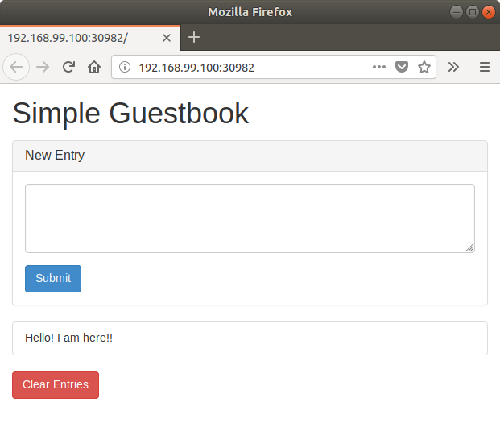

# [실습 3] 영구적인 저장이 필요한 서비스 배포

[TOC]

## LAB

### Kubernets Cluster

- 실습을 위한 쿠버네티스 클러스터 구성 정보 확인

- Volume 명세서 예제 내용 확인 및 Pod 배포 연습

```shell
# LAB003 디렉토리로 이동
$ cd ~/labhome/lab003/

$ labctl restore
0%...10%...20%...30%...40%...50%...60%...70%...80%...90%...100%
Restoring snapshot 'init-status' (83d22d48-eac8-49a9-812d-750af4412469)
0%...10%...20%...30%...40%...50%...60%...70%...80%...90%...100%
Waiting for VM "minikube" to power on...
VM "minikube" has been successfully started.
Switched to context "minikube".
minikube is ready!!
```


### Volume

- Pod 내부 서로 다른 컨테이너에서 Volume 공유 확인


```shell
# LAB003, emptydir-example 디렉토리로 이동
$ cd ~/labhome/lab003/emptydir-example

$ cat wttr-app.yml 
apiVersion: v1
kind: Pod
metadata:
  name: wttr-pod
  labels:
    app: wttr-app
spec:
  containers:
  - name: wttr-frontend
    image: nginx
    ports:
    - containerPort: 80
    volumeMounts:
    - mountPath: /usr/share/nginx/html
      name: content-volume
  - name: wttr-backend
    image: radial/busyboxplus:curl
    volumeMounts:
    - mountPath: /mnt
      name: content-volume
    command: ["/bin/ash"]
    args: ["-c", "echo '<!DOCTYPE html><html><body><h2>Current Weather</h2></body></html>' > /mnt/index.html; while true; do curl -H 'Accept-Language: ko' wttr.in/seoul.png --output /mnt/current-weather.png; sleep 30; echo $(date) - Weather Data Updated; done"]
  volumes:
  - name: content-volume
    emptyDir: {}

---

apiVersion: v1
kind: Service
metadata:
  name: wttr-svc
  labels:
    app: wttr-app
spec:
  type: NodePort
  selector:
    app: wttr-app
  ports:
  - port: 8080
    targetPort: 80

$ kubectl create -f wttr-app.yml 
pod/wttr-pod created
service/wttr-svc created

$ kubectl get pod
NAME       READY     STATUS    RESTARTS   AGE
wttr-pod   2/2       Running   0          34s

$ kubectl get svc
NAME         TYPE        CLUSTER-IP     EXTERNAL-IP   PORT(S)          AGE
kubernetes   ClusterIP   10.96.0.1      <none>        443/TCP          3h
wttr-svc     NodePort    10.99.224.94   <none>        8080:32327/TCP   36s

 kubectl logs wttr-pod wttr-backend
  % Total    % Received % Xferd  Average Speed   Time    Time     Time  Current
                                 Dload  Upload   Total   Spent    Left  Speed
100 45998  100 45998    0     0  22214      0  0:00:02  0:00:02 --:--:-- 34275
Sun Aug 19 21:48:39 UTC 2018 - Weather Data Updated
  % Total    % Received % Xferd  Average Speed   Time    Time     Time  Current
                                 Dload  Upload   Total   Spent    Left  Speed
100 45998  100 45998    0     0  31558      0  0:00:01  0:00:01 --:--:-- 31613

$ minikube service list
|-------------|----------------------|-----------------------------|
|  NAMESPACE  |         NAME         |             URL             |
|-------------|----------------------|-----------------------------|
| default     | kubernetes           | No node port                |
| default     | wttr-svc             | http://192.168.99.100:32327 |
| kube-system | kube-dns             | No node port                |
| kube-system | kubernetes-dashboard | http://192.168.99.100:30000 |
| kube-system | metrics-server       | No node port                |
|-------------|----------------------|-----------------------------|

$ minikube service wttr-svc
Opening kubernetes service default/wttr-svc in default browser...

```


wttr-svc 로 접근하면 아래와 같이 서울 날씨 정보를 볼 수 있습니다.


```shell
$ kubectl exec wttr-pod -c wttr-backend /bin/ash -i --tty
/bin/ash: shopt: not found
[ root@wttr-pod:/ ]$ ls -l /mnt
total 52
-rw-r--r--    1 root     root       44.9K Aug 19 21:51 current-weather.png
-rw-r--r--    1 root     root          95 Aug 19 21:48 index.html

$ kubectl exec wttr-pod -c wttr-frontend /bin/bash -i --tty
root@wttr-pod:/# ls -l /usr/share/nginx/html/
total 52
-rw-r--r-- 1 root root 45998 Aug 19 21:52 current-weather.png
-rw-r--r-- 1 root root    95 Aug 19 21:48 index.html
root@wttr-pod:/# 

$ kubectl describe pod wttr-pod 
Name:         wttr-pod
Namespace:    default
Node:         minikube/10.0.2.15
Start Time:   Mon, 20 Aug 2018 06:47:46 +0900
Labels:       app=wttr-app
Annotations:  <none>
Status:       Running
IP:           172.17.0.5
Containers:
  wttr-frontend:
    Container ID:   docker://918b87d7faaa89e3ea39ad916d51bcbe6a731409f71142699e3499fd90d30fdf
    Image:          nginx
    Image ID:       docker-pullable://nginx@sha256:d85914d547a6c92faa39ce7058bd7529baacab7e0cd4255442b04577c4d1f424
    Port:           80/TCP
    Host Port:      0/TCP
    State:          Running
      Started:      Mon, 20 Aug 2018 06:48:01 +0900
    Ready:          True
    Restart Count:  0
    Environment:    <none>
    Mounts:
      /usr/share/nginx/html from content-volume (rw)
      /var/run/secrets/kubernetes.io/serviceaccount from default-token-wxbvf (ro)
  wttr-backend:
    Container ID:  docker://cf5243a8c4ca37d0554263d255a6d461d531d9aa4ae153a323968004fe038d7e
    Image:         radial/busyboxplus:curl
    Image ID:      docker-pullable://radial/busyboxplus@sha256:a68c05ab1112fd90ad7b14985a48520e9d26dbbe00cb9c09aa79fdc0ef46b372
    Port:          <none>
    Host Port:     <none>
    Command:
      /bin/ash
    Args:
      -c
      echo '<!DOCTYPE html><html><body><h2>Current Weather</h2></body></html>' > /mnt/index.html; while true; do curl -H 'Accept-Language: ko' wttr.in/seoul.png --output /mnt/current-weather.png; sleep 30; echo $(date) - Weather Data Updated; done
    State:          Running
      Started:      Mon, 20 Aug 2018 06:48:07 +0900
    Ready:          True
    Restart Count:  0
    Environment:    <none>
    Mounts:
      /mnt from content-volume (rw)
      /var/run/secrets/kubernetes.io/serviceaccount from default-token-wxbvf (ro)

```


### PV and PVC

- PV 및 PVC 명세서 예제 내용 확인 및 배포 연습

- 외부 스토리지 서비스를 이용하는 PV 배포
- Pod 내 PVC 추가하여 PV 를 사용하는 서비스 배포

```shell
# LAB003 디렉토리로 이동
$ cd ~/labhome/lab003/pv-example

# docker cli 명령어가 localhost 가 아니라 minikube 안에 있는 docker 데몬을 바라보도록 환경 설정 변경
$ eval $(minikube docker-env)

# 호스트에서 guesbook-python 을 빌드. 이후 결과물은 로컬이 아니라 minikube 안에 저장됩니다.
$ docker build -t guestbook-python:v1 .
Sending build context to Docker daemon   7.68kB
Step 1/5 : FROM python:2-alpine
2-alpine: Pulling from library/python
8e3ba11ec2a2: Pull complete 
ea489525e565: Pull complete 
888674c38387: Pull complete 
d38724cba2df: Pull complete 
Digest: sha256:aebe7b0616585705523c0683f0fca6108f80f1ae88178133fc7f294e3663af88
Status: Downloaded newer image for python:2-alpine
 ---> 7c306adf1b3d
Step 2/5 : RUN pip install redis flask
 ---> Running in c5677b6edc65
Collecting redis
  Downloading https://files.pythonhosted.org/packages/3b/f6/7a76333cf0b9251ecf49efff635015171843d9b977e4ffcf59f9c4428052/redis-2.10.6-py2.py3-none-any.whl (64kB)
Collecting flask
  Downloading https://files.pythonhosted.org/packages/7f/e7/08578774ed4536d3242b14dacb4696386634607af824ea997202cd0edb4b/Flask-1.0.2-py2.py3-none-any.whl (91kB)
Collecting Werkzeug>=0.14 (from flask)
  Downloading https://files.pythonhosted.org/packages/20/c4/12e3e56473e52375aa29c4764e70d1b8f3efa6682bef8d0aae04fe335243/Werkzeug-0.14.1-py2.py3-none-any.whl (322kB)
Collecting click>=5.1 (from flask)
  Downloading https://files.pythonhosted.org/packages/34/c1/8806f99713ddb993c5366c362b2f908f18269f8d792aff1abfd700775a77/click-6.7-py2.py3-none-any.whl (71kB)
Collecting itsdangerous>=0.24 (from flask)
  Downloading https://files.pythonhosted.org/packages/dc/b4/a60bcdba945c00f6d608d8975131ab3f25b22f2bcfe1dab221165194b2d4/itsdangerous-0.24.tar.gz (46kB)
Collecting Jinja2>=2.10 (from flask)
  Downloading https://files.pythonhosted.org/packages/7f/ff/ae64bacdfc95f27a016a7bed8e8686763ba4d277a78ca76f32659220a731/Jinja2-2.10-py2.py3-none-any.whl (126kB)
Collecting MarkupSafe>=0.23 (from Jinja2>=2.10->flask)
  Downloading https://files.pythonhosted.org/packages/4d/de/32d741db316d8fdb7680822dd37001ef7a448255de9699ab4bfcbdf4172b/MarkupSafe-1.0.tar.gz
Building wheels for collected packages: itsdangerous, MarkupSafe
  Running setup.py bdist_wheel for itsdangerous: started
  Running setup.py bdist_wheel for itsdangerous: finished with status 'done'
  Stored in directory: /root/.cache/pip/wheels/2c/4a/61/5599631c1554768c6290b08c02c72d7317910374ca602ff1e5
  Running setup.py bdist_wheel for MarkupSafe: started
  Running setup.py bdist_wheel for MarkupSafe: finished with status 'done'
  Stored in directory: /root/.cache/pip/wheels/33/56/20/ebe49a5c612fffe1c5a632146b16596f9e64676768661e4e46
Successfully built itsdangerous MarkupSafe
Installing collected packages: redis, Werkzeug, click, itsdangerous, MarkupSafe, Jinja2, flask
Successfully installed Jinja2-2.10 MarkupSafe-1.0 Werkzeug-0.14.1 click-6.7 flask-1.0.2 itsdangerous-0.24 redis-2.10.6
Removing intermediate container c5677b6edc65
 ---> eba260638b91
Step 3/5 : ADD app /app
 ---> b54cc51929d2
Step 4/5 : EXPOSE 80
 ---> Running in 8ff20dcfbcb1
Removing intermediate container 8ff20dcfbcb1
 ---> 8b0645483b2d
Step 5/5 : CMD [ "python", "/app/app.py" ]
 ---> Running in a99befed26de
Removing intermediate container a99befed26de
 ---> 26dc640794e6
Successfully built 26dc640794e6
Successfully tagged guestbook-python:v1

# docker images 명령어로 빌드된 결과 이미지를 확인합니다. 이때 나오는 목록은 로컬 호스트가 아닌 minikube 안에 저장된 image 목록이 출력됩니다.
$ docker images
REPOSITORY                                 TAG                 IMAGE ID            CREATED             SIZE
guestbook-python                           v1                  26dc640794e6        11 seconds ago      71.6MB
python                                     2-alpine            7c306adf1b3d        2 weeks ago         60MB
nginx                                      latest              c82521676580        3 weeks ago         109MB
k8s.gcr.io/kube-proxy-amd64                v1.10.0             bfc21aadc7d3        4 months ago        97MB
k8s.gcr.io/kube-scheduler-amd64            v1.10.0             704ba848e69a        4 months ago        50.4MB
k8s.gcr.io/kube-apiserver-amd64            v1.10.0             af20925d51a3        4 months ago        225MB
k8s.gcr.io/kube-controller-manager-amd64   v1.10.0             ad86dbed1555        4 months ago        148MB
k8s.gcr.io/etcd-amd64                      3.1.12              52920ad46f5b        5 months ago        193MB
k8s.gcr.io/kube-addon-manager              v8.6                9c16409588eb        6 months ago        78.4MB
k8s.gcr.io/k8s-dns-dnsmasq-nanny-amd64     1.14.8              c2ce1ffb51ed        7 months ago        41MB
k8s.gcr.io/k8s-dns-sidecar-amd64           1.14.8              6f7f2dc7fab5        7 months ago        42.2MB
k8s.gcr.io/k8s-dns-kube-dns-amd64          1.14.8              80cc5ea4b547        7 months ago        50.5MB
k8s.gcr.io/pause-amd64                     3.1                 da86e6ba6ca1        8 months ago        742kB
k8s.gcr.io/metrics-server-amd64            v0.2.1              9801395070f3        8 months ago        42.5MB
k8s.gcr.io/kubernetes-dashboard-amd64      v1.8.1              e94d2f21bc0c        8 months ago        121MB
gcr.io/k8s-minikube/storage-provisioner    v1.8.1              4689081edb10        9 months ago        80.8MB
radial/busyboxplus                         curl                71fa7369f437        3 years ago         4.23MB

$ docker images guestbook-python
REPOSITORY          TAG                 IMAGE ID            CREATED             SIZE
guestbook-python    v1                  ece9e5c11a9e        24 seconds ago      71.6MB

$ kubectl get sc
NAME                 PROVISIONER                AGE
standard (default)   k8s.io/minikube-hostpath   11h

$ kubectl describe sc standard 
Name:            standard
IsDefaultClass:  Yes
Annotations:     kubectl.kubernetes.io/last-applied-configuration={"apiVersion":"storage.k8s.io/v1","kind":"StorageClass","metadata":{"annotations":{"storageclass.beta.kubernetes.io/is-default-class":"true"},"labels":{"addonmanager.kubernetes.io/mode":"Reconcile"},"name":"standard","namespace":""},"provisioner":"k8s.io/minikube-hostpath"}
,storageclass.beta.kubernetes.io/is-default-class=true
Provisioner:           k8s.io/minikube-hostpath
Parameters:            <none>
AllowVolumeExpansion:  <unset>
MountOptions:          <none>
ReclaimPolicy:         Delete
VolumeBindingMode:     Immediate
Events:                <none>

$ cat guestbook-pvc.yml 
kind: PersistentVolumeClaim
apiVersion: v1
metadata:
  name: guestbook-pvc
spec:
  accessModes:
    - ReadWriteOnce
  volumeMode: FileSystem
  resources:
    requests:
      storage: 3Gi
      

$ cat guestbook-app.yml 
apiVersion: v1
kind: Pod
metadata:
  name: guestbook-pod
  labels:
    app: guestbook-app
spec:
  containers:
  - name: guestbook-python
    image: guestbook-python:v1
    ports:
    - containerPort: 80
  - name: guestbook-redis
    image: redis:alpine
    volumeMounts:
    - mountPath: /data
      name: redis-data
  volumes:
  - name: redis-data
    persistentVolumeClaim:
      claimName: guestbook-pvc

---

apiVersion: v1
kind: Service
metadata:
  name: guestbook-svc
  labels:
    app: guestbook-app
spec:
  type: NodePort
  selector:
    app: guestbook-app
  ports:
  - port: 8080
    targetPort: 80

$ kubectl create -f ./
pod/guestbook-pod created
service/guestbook-svc created
persistentvolumeclaim/guestbook-pvc created

$ kubectl get pod,rs,pv,pvc,svc
NAME                READY     STATUS    RESTARTS   AGE
pod/guestbook-pod   2/2       Running   1          1m

NAME                                                        CAPACITY   ACCESS MODES   RECLAIM POLICY   STATUS    CLAIM                   STORAGECLASS   REASON    AGE
persistentvolume/pvc-4b2ea35a-a43e-11e8-b754-080027ef3e31   3Gi        RWO            Delete           Bound     default/guestbook-pvc   standard                 1m

NAME                                  STATUS    VOLUME                                     CAPACITY   ACCESS MODES   STORAGECLASS   AGE
persistentvolumeclaim/guestbook-pvc   Bound     pvc-4b2ea35a-a43e-11e8-b754-080027ef3e31   3Gi        RWO            standard       1m

NAME                    TYPE        CLUSTER-IP     EXTERNAL-IP   PORT(S)          AGE
service/guestbook-svc   NodePort    10.99.224.94   <none>        8080:32327/TCP   1m
service/kubernetes      ClusterIP   10.96.0.1      <none>        443/TCP          11h

$ minikube service list
|-------------|----------------------|-----------------------------|
|  NAMESPACE  |         NAME         |             URL             |
|-------------|----------------------|-----------------------------|
| default     | guestbook-svc        | http://192.168.99.100:32327 |
| default     | kubernetes           | No node port                |
| kube-system | kube-dns             | No node port                |
| kube-system | kubernetes-dashboard | http://192.168.99.100:30000 |
| kube-system | metrics-server       | No node port                |
|-------------|----------------------|-----------------------------|


```


- guestbook-svc 서비스 URLhttp://192.168.99.100:32327/ 를 웹브라우저로 오픈 후 테스트 값 입력 후 저장


```shell
# LAB003 디렉토리로 이동
$ cd ~/labhome/lab003/pv-example

$ kubectl get pv
NAME                                       CAPACITY   ACCESS MODES   RECLAIM POLICY   STATUS    CLAIM                   STORAGECLASS   REASON    AGE
pvc-4b2ea35a-a43e-11e8-b754-080027ef3e31   3Gi        RWO            Delete           Bound     default/guestbook-pvc   standard                 12m


$ minikube ssh
                         _             _            
            _         _ ( )           ( )           
  ___ ___  (_)  ___  (_)| |/')  _   _ | |_      __  
/' _ ` _ `\| |/' _ `\| || , <  ( ) ( )| '_`\  /'__`\
| ( ) ( ) || || ( ) || || |\`\ | (_) || |_) )(  ___/
(_) (_) (_)(_)(_) (_)(_)(_) (_)`\___/'(_,__/'`\____)

# minikube /tmp 경로에 hostpath pv 디렉토리 확인
$ ls /tmp/hostpath-provisioner/                                      
pvc-4b2ea35a-a43e-11e8-b754-080027ef3e31

# hostpath pv 경로 및에 redis 컨테이너에서 저장한 DB 파일 확인
$ ls /tmp/hostpath-provisioner/pvc-4b2ea35a-a43e-11e8-b754-080027ef3e31/
dump.rdb

$ exit
logout

# dump.rdb 파일은 유지한 상태에서 guestbook 재배포
$ kubectl get pods
NAME            READY     STATUS    RESTARTS   AGE
guestbook-pod   2/2       Running   1          17m

$ kubectl delete pod guestbook-pod
pod "guestbook-pod" deleted

$ kubectl delete svc guestbook-svc 
service "guestbook-svc" deleted

$ kubectl create -f guestbook-app.yml 
pod/guestbook-pod created
service/guestbook-svc created

$ kubectl get pods
NAME            READY     STATUS    RESTARTS   AGE
guestbook-pod   2/2       Running   1          46s

$ minikube service list
|-------------|----------------------|-----------------------------|
|  NAMESPACE  |         NAME         |             URL             |
|-------------|----------------------|-----------------------------|
| default     | guestbook-svc        | http://192.168.99.100:30982 |
| default     | kubernetes           | No node port                |
| kube-system | kube-dns             | No node port                |
| kube-system | kubernetes-dashboard | http://192.168.99.100:30000 |
| kube-system | metrics-server       | No node port                |
|-------------|----------------------|-----------------------------|

```


- guestbook pod 및 svc 를 재배포 했지만, 이전에 데이터는 pv 에 남아 삭제되지 않고 계속해서 사용가능함을 확인



```shell
# LAB 환경 초기화 후 종료
$ labctl restore
0%...10%...20%...30%...40%...50%...60%...70%...80%...90%...100%
Restoring snapshot 'init-status' (01419346-a9c2-4ca6-8375-2e8f12c6762f)
0%...10%...20%...30%...40%...50%...60%...70%...80%...90%...100%
Waiting for VM "minikube" to power on...
VM "minikube" has been successfully started.
Switched to context "minikube".
minikube is ready!!
```


## References

* https://kubernetes.io/docs/concepts/storage/volumes/
* https://kubernetes.io/docs/concepts/storage/persistent-volumes/
* https://kubernetes.io/docs/concepts/storage/storage-classes/
* https://github.com/kubernetes/minikube/blob/master/docs/persistent_volumes.md