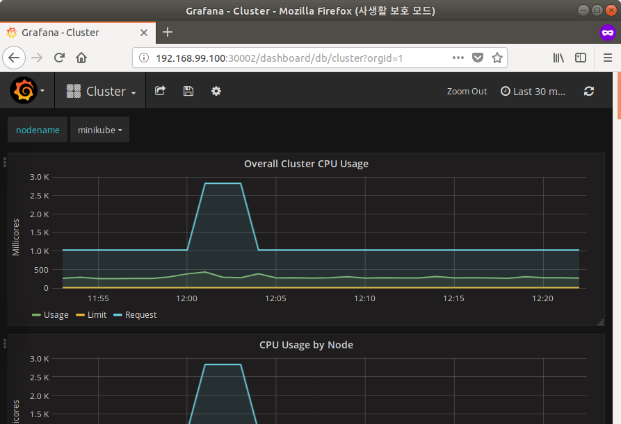
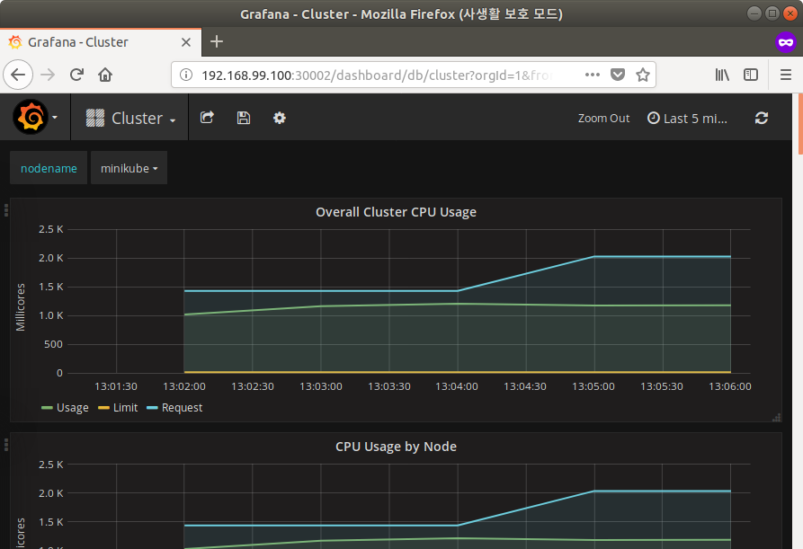

[실습 6] 오토 스케일링 클러스터 배포

[TOC]

## LAB

### Kubernetes Cluster

- 실습을 위한 쿠버네티스 클러스터 구성 정보 확인
  - Autoscaling 을 위해서는 리소스 사용량 모니터링을 위한 heapster, metrics-server 애드온이 필요합니다.

```shell
# LAB006 실습을 위한 경로로 이동
$ cd ~/labhome/lab006

# minikube heapster, metrics-server 애드온 활성화
$ minikube addons enable heapster
heapster was successfully enabled

$ minikube addons enable metrics-server
metrics-server was successfully enabled

# minikube 활성화 된 애드온 목록에서 heapster, metrics-server 확인
$ minikube addons list
- addon-manager: enabled
- coredns: disabled
- dashboard: enabled
- default-storageclass: enabled
- efk: disabled
- freshpod: disabled
- heapster: enabled
- ingress: enabled
- kube-dns: enabled
- metrics-server: enabled
- nvidia-driver-installer: disabled
- nvidia-gpu-device-plugin: disabled
- registry: disabled
- registry-creds: disabled
- storage-provisioner: enabled

# labctrl rebuild 명령으로 minikube 초기화

$ labctl rebuild
Deleting local Kubernetes cluster...
Machine deleted.
Starting local Kubernetes v1.10.0 cluster...
Starting VM...
Getting VM IP address...
Moving files into cluster...
Setting up certs...
Connecting to cluster...
Setting up kubeconfig...
Starting cluster components...
Kubectl is now configured to use the cluster.
Loading cached images from config file.
Switched to context "minikube".
0%...10%...20%...30%...40%...50%...60%...70%...80%...90%...100%
Snapshot taken. UUID: 84790685-eb68-4783-a693-2234fe0fe45f
minikube is ready!!

# minikube 와 kubectl 연결 상태 확인
$ kubectl cluster-info 
Kubernetes master is running at https://192.168.99.100:8443
KubeDNS is running at https://192.168.99.100:8443/api/v1/namespaces/kube-system/services/kube-dns:dns/proxy

To further debug and diagnose cluster problems, use 'kubectl cluster-info dump'.

# heapster, metrics-server 애드온 포드 구동 상태 확인
$ kubectl get pod -n kube-system
NAME                                        READY     STATUS    RESTARTS   AGE
default-http-backend-59868b7dd6-2r98r       1/1       Running   0          8m
etcd-minikube                               1/1       Running   0          7m
heapster-kvcfw                              1/1       Running   0          8m
influxdb-grafana-86smx                      2/2       Running   0          8m
kube-addon-manager-minikube                 1/1       Running   0          8m
kube-apiserver-minikube                     1/1       Running   0          8m
kube-controller-manager-minikube            1/1       Running   0          8m
kube-dns-86f4d74b45-fhmrm                   3/3       Running   0          8m
kube-proxy-d9x2d                            1/1       Running   0          8m
kube-scheduler-minikube                     1/1       Running   0          8m
kubernetes-dashboard-5498ccf677-69tsb       1/1       Running   0          8m
metrics-server-85c979995f-6qvtc             1/1       Running   0          8m
nginx-ingress-controller-5984b97644-cpdnq   1/1       Running   0          8m
storage-provisioner                         1/1       Running   0          8m


# 만약 LAB 실행 중 문제가 있을 경우 아래 두가지 명령어를 이용해 복구할 수 있습니다.
$ labctl --help
Please use corret option [restore|rebuild]

   labctl restore: Quick lab restore
   labctl rebuild: Complete lab rebuild
```


### Manual Scaling

- 오토 스케일링을 위한 애플리케이션 클러스터 배포

- 사용자가 직접 replica 개수 변경하는 매뉴얼 스케일링

```shell
# 스케일링 테스트를 위한 애플리케이션 클러스터 배포
# 여기서는 yml 명세 파일 없이 kubectl run 명령어 하나로 Deployment 및 Service 를 동시에 생성합니다.

$ kubectl run scalable-app --image=k8s.gcr.io/hpa-example --requests=cpu=200m --expose --port=80
service/scalable-app created
deployment.apps/scalable-app created

# 배포된 Deployment 및 Service 확인
$ kubectl get deploy
NAME           DESIRED   CURRENT   UP-TO-DATE   AVAILABLE   AGE
scalable-app   1         1         1            1           1m

$ kubectl get service
NAME           TYPE        CLUSTER-IP     EXTERNAL-IP   PORT(S)   AGE
kubernetes     ClusterIP   10.96.0.1      <none>        443/TCP   39m
scalable-app   ClusterIP   10.99.231.19   <none>        80/TCP    1m

# Deployment 에 현재 목표 Replica 개수가 1개로 설정되어 있음을 확인
$ kubectl describe deploy scalable-app 
Name:                   scalable-app
Namespace:              default
CreationTimestamp:      Tue, 21 Aug 2018 11:29:09 +0900
Labels:                 run=scalable-app
Annotations:            deployment.kubernetes.io/revision=1
Selector:               run=scalable-app
Replicas:               1 desired | 1 updated | 1 total | 1 available | 0 unavailable

# 현재 Deployment 에서 사용하는 ReplicaSet 이 1 개임을 확인 
$ kubectl get rs
NAME                      DESIRED   CURRENT   READY     AGE
scalable-app-76cbc99786   10        10        10        32m


# kubectl scale 명령어로르 이용하여 수동으로 Pod Replica 를 10개로 스케일 확장 테스트

$ kubectl scale --replicas=10 deploy/scalable-app
deployment.extensions/scalable-app scaled
$ kubectl rollout status deploy/scalable-app
Waiting for deployment "scalable-app" rollout to finish: 5 of 10 updated replicas are available...
Waiting for deployment "scalable-app" rollout to finish: 6 of 10 updated replicas are available...
Waiting for deployment "scalable-app" rollout to finish: 7 of 10 updated replicas are available...
Waiting for deployment "scalable-app" rollout to finish: 8 of 10 updated replicas are available...
Waiting for deployment "scalable-app" rollout to finish: 9 of 10 updated replicas are available...
deployment "scalable-app" successfully rolled out

# Deployment 에 Replica 개수를 변경하였지만, 이미지 변경과 같은 Pod 재배포가 필요없어 새로운 ReplicaSet 생성되지 않음
$ kubectl get rs
NAME                      DESIRED   CURRENT   READY     AGE
scalable-app-76cbc99786   10        10        10        32m

# Deployment 의 Replica 개수를 다시 1개로 줄이고 다음 단계 진행
$ kubectl scale --replicas=1 deploy/scalable-app
deployment.extensions/scalable-app scaled

```


### Auto Scaling

- CPU 사용량을 기준 오토 스케일러 (hpa) 오브젝트 생성

- Load Generator 를 생성하여 오토 스케일링 기능 확인

- Load Generator 제거 후 스케일 다운 확인

```shell
# kubectl top 명령어를 통해 kubernetes 모니터링 시스템 (heapster, metric-server 등)을 통해 수집된 자원 사용량 확인

$ kubectl top node
NAME       CPU(cores)   CPU%      MEMORY(bytes)   MEMORY%   
minikube   271m         6%        1216Mi          15%     

$ kubectl top pod
NAME                            CPU(cores)   MEMORY(bytes)   
scalable-app-76cbc99786-h6ghw   0m           9Mi 

# minikube heapster 애드온으로 설치된 grafana 대쉬보드에서 kubernest 리소스 사용량 확인

$ minikube service list
|-------------|----------------------|-----------------------------|
|  NAMESPACE  |         NAME         |             URL             |
|-------------|----------------------|-----------------------------|
| default     | kubernetes           | No node port                |
| default     | scalable-app         | No node port                |
| kube-system | default-http-backend | http://192.168.99.100:30001 |
| kube-system | heapster             | No node port                |
| kube-system | kube-dns             | No node port                |
| kube-system | kubernetes-dashboard | http://192.168.99.100:30000 |
| kube-system | metrics-server       | No node port                |
| kube-system | monitoring-grafana   | http://192.168.99.100:30002 |
| kube-system | monitoring-influxdb  | No node port                |
|-------------|----------------------|-----------------------------|

# 위에서 확인한 monitoring-grafana 의 URL 을 복사하여 웹브라우저에서 grafana 대쉬보드 접근

```


웹브라우저에서 grafana 대쉬보드 접근 (http://192.168.99.100:30002)



grafana 대쉬보드는 실습이 진행되는 동안 계속해서 열어두고 사용량 추이를 관찰


```shell
# Horizontal Pod Autoscaler(hpa) 생성

$ kubectl autoscale deploy scalable-app --cpu-percent=50 --min=1 --max=10
horizontalpodautoscaler.autoscaling/scalable-app autoscaled

# hpa 이 metric-server 에서 Target CPU 사용량을 받아오는지 확인 (TARGETS)

### CPU 자원 사용량 정상적으로 표시
$ kubectl get hpa
NAME           REFERENCE                 TARGETS   MINPODS   MAXPODS   REPLICAS   AGE
scalable-app   Deployment/scalable-app   0%/50%    1         10        1          35s

# 테스트 로드를 발생시키기 위한 busybox 생성 후 while 문으로 로드 발생
# while true; do curl http://scalable-app.default.svc.cluster.local; done

$ kubectl run busyboxplus --image=radial/busyboxplus:curl -i --tty --rm
If you don't see a command prompt, try pressing enter.
[ root@busyboxplus-5697648fcc-2bd2t:/ ]$ while true; do curl http://scalable-app.default.svc.cluster.local; done
OK!OK!OK!OK!OK!OK!OK!OK!OK!OK!OK!OK!OK!OK!OK!OK!OK!OK!OK!OK!OK!OK!OK!OK!OK!OK!OK!OK!OK!OK!OK!OK!OK!OK!OK!OK!OK!OK!OK!OK!OK!OK!OK!OK!OK!OK!OK!OK!OK!OK!OK!OK!OK!OK!OK!OK!OK!OK!OK!OK!OK!OK!OK!OK!OK!OK!OK!OK!OK!OK!OK!OK!OK!OK!OK!OK!OK!OK!OK!OK!OK!OK!OK!OK!OK!OK!OK!OK!OK!OK!OK!OK!OK!OK!OK!OK!OK!OK!OK!OK!OK!OK!OK!OK!OK!OK!OK!OK!OK!OK!OK!OK!OK!OK!OK!OK!OK!OK!OK!OK!OK!OK!OK!OK!OK!OK!OK!OK!OK!OK!OK!OK!OK!OK!OK!OK!OK!OK!OK!OK!OK!OK!OK!OK!OK!OK!OK!OK!OK!OK!OK!^C

# 이후 busybox 가 구동중인 터미널을 계속해서 유지하여 지속적인 로드를 발생시킵니다.

# 새로운 터미널 오픈 후 아래 내용 계속 진행
# hpa 에서 관측되는 Target CPU 사용률이 증가함을 확인, 이로 인해 REPLICAS 가 3 으로 변경되었습니다.
$ kubectl get hpa
NAME           REFERENCE                 TARGETS    MINPODS   MAXPODS   REPLICAS   AGE
scalable-app   Deployment/scalable-app   140%/50%   1         10        3          11m

# hpa 에서 증가시킨 REPLICAS 만큼 자동으로 pod 늘어나고 있음을 확인할 수 있습니다.
$ kubectl get pod
NAME                            READY     STATUS    RESTARTS   AGE
busyboxplus-5697648fcc-2bd2t    1/1       Running   0          5m
scalable-app-76cbc99786-4rlfp   1/1       Running   0          8s
scalable-app-76cbc99786-cc6j7   1/1       Running   0          8s
scalable-app-76cbc99786-cm7vq   1/1       Running   0          8s
scalable-app-76cbc99786-fz42r   1/1       Running   0          4m
scalable-app-76cbc99786-h6ghw   1/1       Running   0          1h
scalable-app-76cbc99786-x5vkl   1/1       Running   0          4m

# 그리고 이전에 열어둔 grafana 대쉬보드를 이용하면 사용량 변화의 추이를 쉽게 알 수 있습니다.

```


증가되는 로드만큼 Node CPU 사용량 증가 그래프 확인




```shell

# 배포되는 pod 가 늘어나는 만큼 평균 CPU 사용율은 줄어들고 있음을 알 수 있습니다.
$ kubectl get hpa
NAME           REFERENCE                 TARGETS   MINPODS   MAXPODS   REPLICAS   AGE
scalable-app   Deployment/scalable-app   77%/50%   1         10        6          16m

# busybox 로드 생성기를 종료하고, hpa 에서 다시 자동으로 pod 를 줄이는지를 확인합니다.

!OK!OK!OK!OK!OK!OK!OK!OK!OK!OK!OK!OK!OK!OK!OK!OK!OK!OK!OK!OK!OK!OK!OK!OK!OK!OK!OK!OK!OK!OK!OK!OK!OK!OK!OK!OK!OK!OK!OK!OK!OK!OK!OK!OK!OK!OK!OK!OK!OK!OK!OK!OK!OK!OK!OK!OK!OK!OK!OK!OK!OK!OK!OK!OK!OK!OK!OK!OK!OK!OK!OK!OK!OK!OK!OK!OK!OK!OK!OK!OK!OK!OK!OK!OK!OK!OK!OK!OK!^C <= Ctrl + "C" 키를 눌러 중지
[ root@busyboxplus-5697648fcc-2bd2t:/ ]$ exit
Session ended, resume using 'kubectl attach busyboxplus-5697648fcc-2bd2t -c busyboxplus -i -t' command when the pod is running
deployment.apps "busyboxplus" deleted

$ kubectl get hpa
NAME           REFERENCE                 TARGETS   MINPODS   MAXPODS   REPLICAS   AGE
scalable-app   Deployment/scalable-app   59%/50%   1         10        10         18m

# kubectl describe 를 이용해 hpa 이벤트 확인
$ kubectl describe hpa
Name:                                                  scalable-app
Namespace:                                             default
Labels:                                                <none>
Annotations:                                           <none>
CreationTimestamp:                                     Tue, 21 Aug 2018 12:51:02 +0900
Reference:                                             Deployment/scalable-app
Metrics:                                               ( current / target )
  resource cpu on pods  (as a percentage of request):  0% (0) / 50%
Min replicas:                                          1
Max replicas:                                          10
Deployment pods:                                       10 current / 10 desired
Conditions:
  Type            Status  Reason            Message
  ----            ------  ------            -------
  AbleToScale     False   BackoffBoth       the time since the previous scale is still within both the downscale and upscale forbidden windows
  ScalingActive   True    ValidMetricFound  the HPA was able to successfully calculate a replica count from cpu resource utilization (percentage of request)
  ScalingLimited  True    TooFewReplicas    the desired replica count is more than the maximum replica count
Events:
  Type    Reason             Age   From                       Message
  ----    ------             ----  ----                       -------
  Normal  SuccessfulRescale  10m   horizontal-pod-autoscaler  New size: 3; reason: cpu resource utilization (percentage of request) above target
  Normal  SuccessfulRescale  6m    horizontal-pod-autoscaler  New size: 6; reason: cpu resource utilization (percentage of request) above target
  Normal  SuccessfulRescale  2m    horizontal-pod-autoscaler  New size: 10; reason: cpu resource utilization (percentage of request) above target

# 이후 최종적으로 REPLICAS 가 0 으로 줄어들면서, pod 가 자동적으로 줄어 듭니다.

$ kubectl get hpa
NAME           REFERENCE                 TARGETS   MINPODS   MAXPODS   REPLICAS   AGE
scalable-app   Deployment/scalable-app   0%/50%    1         10        1          38m

```


## References

* https://github.com/kubernetes/community/blob/master/contributors/design-proposals/instrumentation/monitoring_architecture.md