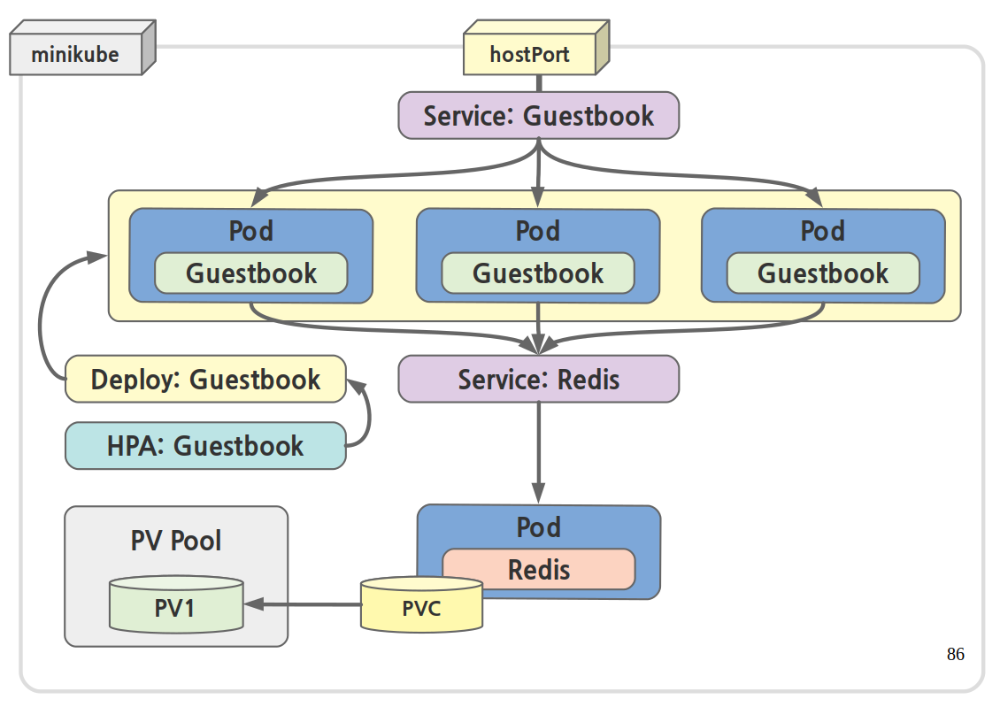

# [실습 7] 쿠버네티스 종합 실습

[TOC]

## LAB

### Kubernetes Cluster

- 실습을 위한 쿠버네티스 클러스터 구성 정보 확인

```shell
# LAB007 실습을 위한 경로로 이동
$ cd ~/labhome/lab007

$ kubectl cluster-info 
Kubernetes master is running at https://192.168.99.100:8443
KubeDNS is running at https://192.168.99.100:8443/api/v1/namespaces/kube-system/services/kube-dns:dns/proxy

To further debug and diagnose cluster problems, use 'kubectl cluster-info dump'.

# 만약 LAB 실행 중 문제가 있을 경우 아래 두가지 명령어를 이용해 복구할 수 있습니다.
$ labctl --help
Please use corret option [restore|rebuild]

   labctl restore: Quick lab restore
   labctl rebuild: Complete lab rebuild
```


## 종합 실습

- 지금까지 배운 도커와 쿠버네티스 클러스터의 개념 및 기능을 확인하는 종합 실습
- 예제로 제공되는 YAML 명세서 및 애플리케이션 구성도 문서를 참고하여 , 쿠버네티스 클러스터에 애플리케이션을 배포한다 .
- 배포 중 발생하는 이슈에 대해서 원인을 찾아 수정하여 , 최종 애플리케이션 구동을 확인한다 .


### 최종 애플리케이션 아키텍처 드로잉



### 아키텍처 요구 조건

* 전체 애플리케이션은 guestbook web tier 와 redis db tier 로 2개의 층으로 구성되어 있습니다.
* guestbook 컨테이너는 ~/labhome/lab007/guestbook 경로에 있는 애플리케이션 파일들을 docker image 로 빌드하여 사용하며 tag 는 guestbook:v3 를 붙여 구분해 주십시오.
* guestbook tier 는 최소 3개의 pod 가 구동 중이어야 하며, 50% CPU 사용율을 목표로 최대 12개까지 Autoscaling 이 가능하여야 합니다.
* redis tier 는 하나의 pod 로 구성되어 있으며, redis 의 /data 경로는 PVC 를 통해 받은 50 GiB 크기의 볼륨을 저장공간으로 사용하여야 합니다.
* guestbook tier 은 혹시 있을 수 있는 redis 증축을 대비하여 redis tier 에 접근하기 위하여, Redis 서비스를 거쳐서 접근합니다.
* 외부 사용자는 guestbook 서비스를 이용해 접근하며, 이때 guestbook 서비스는 hostPort 를 사용하여 로컬 머신에서 직접 접근할 수 있도록 합니다.